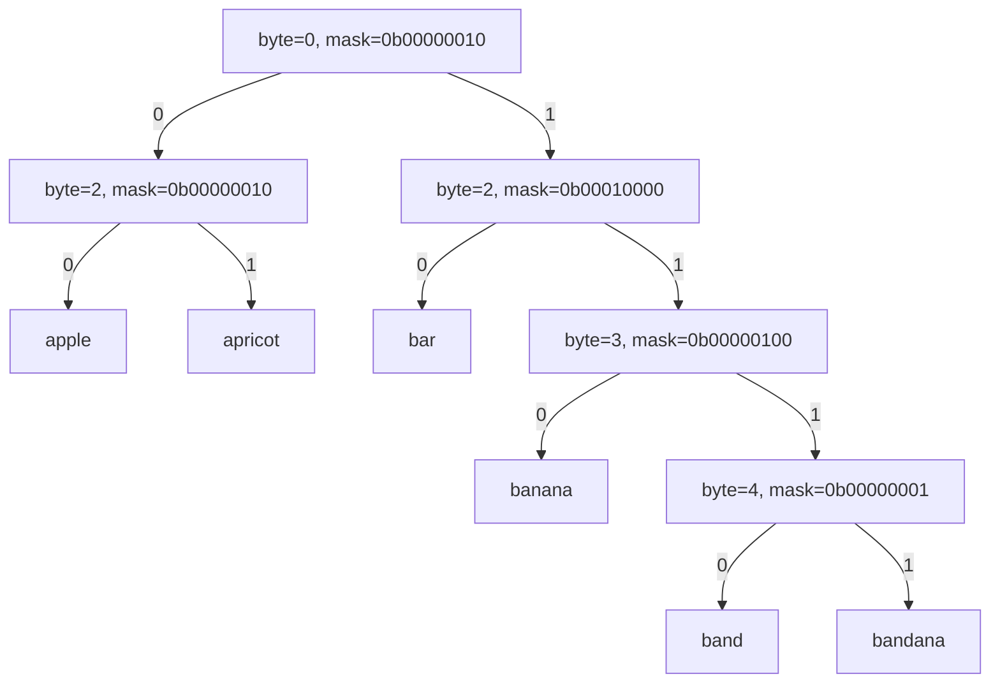

在处理字符串集合或固定长度的位串集合时，我们常见的选择是 **哈希表**、**二叉搜索树（BST）**、**前缀树（Trie）** 等。  
然而，如果我们需要**高效的有序查询、前缀搜索**，并且还希望实现起来尽可能简单，Crit-bit 树（Critical Bit Tree）是一个极佳的选择。

它是一种**基于位**的二叉搜索树，专注于**字符串或位串的存储与查询**，通过“关键位”（critical bit）来分割数据。  

## Crit-bit 树的核心思想
Crit-bit（Critical Bit Tree）是一种按**关键位**（critical bit）划分路径的二叉树。它存储**字符串或位串**，每个内部节点不存“值”，只记录“第一次分歧发生在第几个字节、第几位（bit）”，据此把集合分成两半（该位为 0 的一边、为 1 的另一边）。**所有实际的字符串（键）都在叶子**。

其基本原理：
1. **数据（字符串）存储在叶子节点中**；
2. **内部节点不存数据，只存分割信息**，即`byte`和`bit`，其中
    - `byte`：两个字符串第一次不同的字节位置
    - `bit`：该字节中第一次不同的位位置（critical bit）
3. 查询时，根据关键位的值（0/1）决定向左还是向右子树走。

这样，Crit-bit 树的结构完全由存储的字符串集合唯一确定，不需要自平衡机制，也不会因为插入顺序不同而影响形态。所以它的特点：
- **结构唯一**：对同一组键，树形结构（按最高不同位分割）是确定的，不依赖插入顺序。
- **不需要自平衡**：最长路径与**最长键长度**有关，而非元素个数。
- **天然有序 + 支持前缀**：可以做有序遍历、找后继、做前缀枚举（很多哈希结构不容易做到）。

## 原理实现
### 数据结构（Rust版）
根据Crit-bit树的定义，其中包含两个节点：
- **叶子**存放字符串；
- **内部节点**记录第一次分歧的位置：
    - `byte`: 字节索引
    - `mask`: 在该字节里的一位掩码
    - `child[0/1]`: 两个子树，按该位为`0`或`1`分流
- 为了简化可变共享结构，我们用**`Rc<RefCell<Node>>`**。

使用枚举来表示节点的类型：

``` Rust
enum Node {
    Internal { /* 分歧点信息 + 子指针 */ },
    Leaf(String),
}
```

### 定位`关键位`（critical bit）
比较两个字符串a和b：
1. 从头逐**字节**比较，直到遇到第一个不同的字节`diff = a[i] ^ b[i]`；
2. 在`diff`里找到**最高位的 1**（最高不同位）作为`mask`；
3. `byte = i`，`mask` 如上。这个 `(byte, mask)` 就是**分歧点**。

> 选择”最高不同位“是为了树的**唯一性**，与很多参考实现保持一致。

### 插入的正确位置（“两段式”下探）
插入一个新建节点时：
1. 根据 `(byte, mask)`先**一路下探**到叶子，拿到“最相近”的已有叶子；
2. 算出新建节点与该叶子的 `(byte, mask)`；
3. 再从根**第二次下探**，沿着已有内部节点：
    - 只要当前节点的 `(byte, mask)` **更靠前**（字节更小，或同字节时掩码更“高”）就继续下探；
    - 一旦遇到**超过**新分歧点的节点位置，就在这里把新内部节点插进去（它应当出现在更靠上的层级）。

这一步是 Crit-bit 插入的“关键”，保证树的结构不依赖插入顺序。

### 删除的逻辑
删除一个叶子节点：
1. 下探到叶子，同时用**栈**记录路径（父节点 + 走的方向）；
2. 找到叶子与其**父亲**，用它的“兄弟”替换父亲（**相当于把父节点和被删叶子一并拿掉**）；
3. 更新上一层父指针或根。

## 代码实现

```rust
use std::cell::RefCell;
use std::cmp::Ordering;
use std::rc::Rc;

type Link = Rc<RefCell<Node>>;

#[derive(Debug, Clone)]
enum Node {
    Internal {
        byte: usize,       // 第一次不同的字节位置
        mask: u8,          // 在该字节上的关键位（只有一个 bit 为 1）
        child: [Link; 2],  // 该位为 0/1 的两棵子树
    },
    Leaf(String),          // 实际存储的节点
}

#[derive(Debug, Default)]
pub struct CritBit {
    root: Option<Link>,
}

impl CritBit {
    pub fn new() -> Self {
        Self { root: None }
    }

    /// 是否包含键
    pub fn contains(&self, key: &str) -> bool {
        match self.find_leaf(key) {
            Some(leaf_key) => leaf_key == key,
            None => false,
        }
    }

    /// 插入，返回是否真的插入了（已存在则返回 false）
    pub fn insert(&mut self, key: String) -> bool {
        if self.root.is_none() {
            self.root = Some(Rc::new(RefCell::new(Node::Leaf(key))));
            return true;
        }

        // 1) 先下探到叶子
        let (leaf_link, _path) = self.descend_to_leaf_and_path(key.as_str());
        let existing = match &*leaf_link.borrow() {
            Node::Leaf(s) => s.clone(),
            _ => unreachable!("descend_to_leaf 应该到达叶子"),
        };

        if existing == key {
            return false; // 已存在
        }

        // 2) 找分歧点（byte, mask）
        let (byte, mask) = first_diff_bit(&existing, &key);

        // 3) 再从根走一遍，找到应该插入的位置（保持树的唯一结构）
        let mut parent_opt: Option<Link> = None;
        let mut dir_from_parent: Option<usize> = None;
        let mut cursor = self.root.clone().unwrap();

        loop {
            let go_next = match &*cursor.borrow() {
                Node::Internal { byte: b, mask: m, child } => {
                    // 如果当前节点分歧点“更靠前”，继续往下
                    match compare_split((*b, *m), (byte, mask)) {
                        Ordering::Less => {
                            // 继续根据新 key 的该节点分支走下去
                            let c = get_byte(&key, *b);
                            let d = direction(c, *m);
                            parent_opt = Some(cursor.clone());
                            dir_from_parent = Some(d);
                            Some(child[d].clone())
                        }
                        Ordering::Equal | Ordering::Greater => {
                            // 当前节点位置已经“超过了”新分歧点，应该在这里插入
                            None
                        }
                    }
                }
                Node::Leaf(_) => None, // 到叶子就该插在这里上面
            };

            if let Some(next) = go_next {
                cursor = next;
            } else {
                break;
            }
        }

        // 4) 构造新内部节点：把新键、旧路径上的那个子树分到两侧
        let dir_new = direction(get_byte(&key, byte), mask);
        let new_leaf = Rc::new(RefCell::new(Node::Leaf(key)));
        // “另一边”是根据 existing 的该位来定
        let dir_exist = direction(get_byte(&existing, byte), mask);
        debug_assert!(dir_new != dir_exist);

        // 被插的位置：若 parent 存在，child[dir] 位置被替换；若 parent 不在，替换 root
        let (left, right) = if dir_new == 0 {
            (new_leaf, cursor.clone())
        } else {
            (cursor.clone(), new_leaf)
        };

        let new_internal = Rc::new(RefCell::new(Node::Internal {
            byte,
            mask,
            child: [left, right],
        }));

        match (parent_opt, dir_from_parent) {
            (Some(p), Some(d)) => {
                // 把 parent 的 child[d] 改成 new_internal
                if let Node::Internal { child, .. } = &mut *p.borrow_mut() {
                    child[d] = new_internal;
                } else {
                    unreachable!();
                }
            }
            _ => {
                // 插在根
                self.root = Some(new_internal);
            }
        }

        true
    }

    /// 删除，返回是否真的删除
    pub fn remove(&mut self, key: &str) -> bool {
        if self.root.is_none() {
            return false;
        }

        // 栈记录 (parent_link, direction) —— direction 指向下走的分支
        let mut stack: Vec<(Link, usize)> = Vec::new();
        let mut cursor = self.root.clone().unwrap();

        // 下探，同时记录路径
        loop {
            match &*cursor.borrow() {
                Node::Internal { byte, mask, child } => {
                    let d = direction(get_byte(key, *byte), *mask);
                    stack.push((cursor.clone(), d));
                    cursor = child[d].clone();
                }
                Node::Leaf(s) => {
                    if s != key {
                        return false; // 不存在
                    }
                    break;
                }
            }
        }

        // 如果根就是叶子
        if stack.is_empty() {
            self.root = None;
            return true;
        }

        // 弹出叶子的父亲
        let (parent, d_from_parent) = stack.pop().unwrap();

        // 父亲必须是内部节点。叶子的兄弟节点要接到爷爷上（或变为根）
        let (sibling, grand) = {
            let p_borrow = parent.borrow();
            let (byte, mask, child) = match &*p_borrow {
                Node::Internal { byte, mask, child } => (*byte, *mask, [child[0].clone(), child[1].clone()]),
                _ => unreachable!(),
            };
            // 兄弟分支
            let sib = if d_from_parent == 0 { child[1].clone() } else { child[0].clone() };
            (sib, stack.pop())
        };

        match grand {
            Some((g, d_from_grand)) => {
                // g 的 child[d] 替换为 sibling
                if let Node::Internal { child, .. } = &mut *g.borrow_mut() {
                    child[d_from_grand] = sibling;
                } else {
                    unreachable!();
                }
            }
            None => {
                // 删除后 sibling 成为根
                self.root = Some(sibling);
            }
        }

        true
    }

    /// 以某个前缀开头的所有键
    pub fn keys_with_prefix(&self, prefix: &str) -> Vec<String> {
        let mut out = Vec::new();
        if self.root.is_none() {
            return out;
        }
        let mut cursor = self.root.clone().unwrap();

        // 先尽可能沿前缀路径下探
        loop {
            match &*cursor.borrow() {
                Node::Internal { byte, mask, child } => {
                    // 若分歧点在 prefix 长度之后，说明两边都有可能匹配（因为前缀并未到此位）
                    if *byte >= prefix.len() {
                        // 两边都走
                        self.collect_all(child[0].clone(), prefix, &mut out);
                        self.collect_all(child[1].clone(), prefix, &mut out);
                        return out;
                    }
                    // 否则按前缀对应位方向下探
                    let d = direction(get_byte(prefix, *byte), *mask);
                    cursor = child[d].clone();
                }
                Node::Leaf(s) => {
                    if s.starts_with(prefix) {
                        out.push(s.clone());
                    }
                    return out;
                }
            }
        }
    }

    fn collect_all(&self, link: Link, prefix: &str, out: &mut Vec<String>) {
        match &*link.borrow() {
            Node::Internal { child, .. } => {
                self.collect_all(child[0].clone(), prefix, out);
                self.collect_all(child[1].clone(), prefix, out);
            }
            Node::Leaf(s) => {
                if s.starts_with(prefix) {
                    out.push(s.clone());
                }
            }
        }
    }

    /// 返回叶子字符串（如果沿路径终点是叶子）
    fn find_leaf(&self, key: &str) -> Option<String> {
        let mut p = self.root.clone()?;
        loop {
            match &*p.borrow() {
                Node::Internal { byte, mask, child } => {
                    let d = direction(get_byte(key, *byte), *mask);
                    p = child[d].clone();
                }
                Node::Leaf(s) => return Some(s.clone()),
            }
        }
    }

    /// 下探到叶子并返回（叶子 Link，路径中“最后一次到达的内部节点”）
    fn descend_to_leaf_and_path(&self, key: &str) -> (Link, Vec<Link>) {
        let mut path = Vec::new();
        let mut p = self.root.clone().unwrap();
        loop {
            match &*p.borrow() {
                Node::Internal { byte, mask, child } => {
                    path.push(p.clone());
                    let d = direction(get_byte(key, *byte), *mask);
                    p = child[d].clone();
                }
                Node::Leaf(_) => return (p, path),
            }
        }
    }
}

/* ========= 位和字节的小工具 ========= */

/// 取字符串在给定字节位置的字节值；超出长度则视为 0
fn get_byte(s: &str, idx: usize) -> u8 {
    *s.as_bytes().get(idx).unwrap_or(&0)
}

/// 给定“字节”和“掩码”（单 bit），返回方向 0/1
fn direction(byte_val: u8, mask: u8) -> usize {
    if (byte_val & mask) == 0 { 0 } else { 1 }
}

/// 找到两个字符串第一个不同的字节和在那里最高的不同位（mask）
fn first_diff_bit(a: &str, b: &str) -> (usize, u8) {
    let ab = a.as_bytes();
    let bb = b.as_bytes();
    let n = ab.len().max(bb.len());
    for i in 0..n {
        let ca = *ab.get(i).unwrap_or(&0);
        let cb = *bb.get(i).unwrap_or(&0);
        if ca != cb {
            let mut diff = ca ^ cb;
            // 取最高位的 1（MSB）
            // 也可以用内置的 leading_zeros 来做，这里写成通俗循环：
            let mut mask = 0x80u8;
            while mask > 0 && (diff & mask) == 0 {
                mask >>= 1;
            }
            debug_assert!(mask != 0, "diff != 0 时至少有一位不同");
            return (i, mask);
        }
    }
    // 若完全相同，理论上不会调用到这里（插入时已判等）
    (ab.len().min(bb.len()), 0x80)
}

fn compare_split(a: (usize, u8), b: (usize, u8)) -> Ordering {
    match a.0.cmp(&b.0) {
        Ordering::Less => Ordering::Less,
        Ordering::Greater => Ordering::Greater,
        Ordering::Equal => a.1.cmp(&b.1),
    }
}
/* =============== DEMO =============== */

#[cfg(test)]
mod tests {
    use super::*;

    #[test]
    fn basic_insert_contains() {
        let mut t = CritBit::new();
        assert!(t.insert("apple".into()));
        assert!(t.insert("apricot".into()));
        assert!(t.insert("banana".into()));
        assert!(!t.insert("banana".into())); // 重复插入

        assert!(t.contains("apple"));
        assert!(t.contains("apricot"));
        assert!(t.contains("banana"));
        assert!(!t.contains("pear"));
    }

    #[test]
    fn prefix_query() {
        let mut t = CritBit::new();
        for s in ["app", "apple", "applet", "apricot", "banana", "band"] {
            t.insert(s.into());
        }
        let mut v = t.keys_with_prefix("app");
        v.sort();
        assert_eq!(v, vec!["app", "apple", "applet"]);
    }

    #[test]
    fn remove_leaf_cases() {
        let mut t = CritBit::new();
        for s in ["cat", "car", "dog"] { t.insert(s.into()); }
        assert!(t.remove("dog"));
        assert!(!t.contains("dog"));
        assert!(t.contains("cat"));
        assert!(t.contains("car"));

        // 删到只剩一个
        assert!(t.remove("cat"));
        assert!(t.remove("car"));
        assert!(!t.contains("cat"));
        assert!(!t.contains("car"));
        assert!(t.root.is_none());
    }
}

fn main() {
    // 小演示
    let mut t = CritBit::new();
    for s in ["apple", "apricot", "banana", "band", "bandana", "bar"] {
        t.insert(s.into());
    }

    println!("contains('banana') = {}", t.contains("banana"));
    println!("contains('ban') = {}", t.contains("ban"));

    let mut with_ban = t.keys_with_prefix("ban");
    with_ban.sort();
    println!("prefix 'ban': {:?}", with_ban);

    println!("remove('band') = {}", t.remove("band"));
    let mut after = t.keys_with_prefix("ban");
    after.sort();
    println!("prefix 'ban' after remove: {:?}", after);
}
```

代码实现了两段式插入、删除和前缀查询的功能，其中：
- **两段式插入**：先找分歧，再按分歧点坐标 `(byte, mask)` 重新定位插入层级，保证结构唯一。
- **删除**：用路径栈找到叶子的父亲与爷爷，用兄弟替换父亲（连同被删叶子一起消失）。
- **前缀查询**：当分歧点超出前缀长度时，**两边都可能匹配**，直接 DFS 收集；否则继续按前缀位下探。

## 实例演示
依次插入`"apple", "apricot", "banana", "band", "bandana", "bar"`，
### 空树

```
∅
```

### 插入`apple`
由于root是空节点，直接将`apple`作为叶子节点插入

```
Leaf("apple")
```

### 插入`apricot`
比较 `"apple"`和`"apricot"`：

- 逐**字节**比较：前两个字母 "ap" 相同
- 第 3 个字母：`'p' (0x70)` vs `'r' (0x72)`
    - 二进制：p=01110000, r=01110010
    - 差异出现在 **bit 6**

树结构：

```
Internal(byte=2, mask=0b00000010)
├── Leaf("apple")    # bit=0
└── Leaf("apricot")  # bit=1
```

### 插入`banana`
比较 `"banana"` 与根内部节点：
- 第一个字符：`'a' (0x61)` vs `'b' (0x62)`
    - 二进制：01100001 vs 01100010
    - 差异出现在 **byte=0, bit=6**

新的根节点（更高分裂点）：

```
Internal(byte=0, mask=0b00000010)
├── Leaf("apple") + "apricot" 子树
└── Leaf("banana")
```

展开后的完整树：

```
Internal(byte=0, mask=0b00000010)
├── Internal(byte=2, mask=0b00000010)
│   ├── Leaf("apple")
│   └── Leaf("apricot")
└── Leaf("banana")
```

### 插入`band`
比较 `"band"` 和 `"banana"`：
- 前 3 个字母 "ban" 一样
- 第 4 个字母：`'d' (0x64)` vs `'a' (0x61)`
    - 二进制：d=01100100, a=01100001
    - 差异在 **byte=3, bit=5**

树结构：

```
Internal(byte=0, mask=0b00000010)
├── Internal(byte=2, mask=0b00000010)
│   ├── Leaf("apple")
│   └── Leaf("apricot")
└── Internal(byte=3, mask=0b00000100)
    ├── Leaf("banana")
    └── Leaf("band")
```

### 插入`bandana`
比较 `"bandana"` 和 `"band"`：
- 前 4 个字母 "band" 一样
- `"band"`结束了，但 `"bandana"`还有内容
- 差异点在 **字符串长度 / null terminator vs `'a'`**
当`byte=4`时，`band`返回`'0'(0x0)`，而`bandana`是`'a'(0x61)`，则`bit=1`

树结构：

```
Internal(byte=0, mask=0b00000010)
├── Internal(byte=2, mask=0b00000010)
│   ├── Leaf("apple")
│   └── Leaf("apricot")
└── Internal(byte=3, mask=0b00000100)
    ├── Leaf("banana")
    └── Internal(byte=4, mask=0b01000000)
        ├── Leaf("band")
        └── Leaf("bandana")
```

### 插入`bar`
比较`"bar"`和`"banana"`:
- 前两个字符"ba"一样
- 第3个字母：`'r' (0x72)` vs `'n' (0x6E)`
	- 二进制：r=01110010, n=01101110
	- 差异在 **byte=2, bit=3**

树结构：

``` 
Internal(byte=0, mask=0b00000010)
├── Internal(byte=2, mask=0b00010000)   # 新插入的节点
│   ├── Leaf("bar")
│   └── Internal(byte=3, mask=0b00000100)
│       ├── Leaf("banana")
│       └── Internal(byte=4, mask=0b00000001)
│           ├── Leaf("band")
│           └── Leaf("bandana")
└── Internal(byte=2, mask=0b00000010)
    ├── Leaf("apple")
    └── Leaf("apricot")
```

最终的结构图为：



Crit-bit 是一种**极简但强大**的字符串/位串集合结构，本篇介绍了原始Crit-bit树的原理、实现以及插入流程，但是在实际的应用中并不是完全按照原始Crit-bit进行使用的，下一篇文章就来看下OpenBook-V2中的订单树是如何对其进行优化使用的。

更多内容可查看在github上的项目--[深入Solana OpenBook-V2源码分析与DeFi 合约实战](https://github.com/hunshenshi/solana-openbookv2-and-defi-in-action)